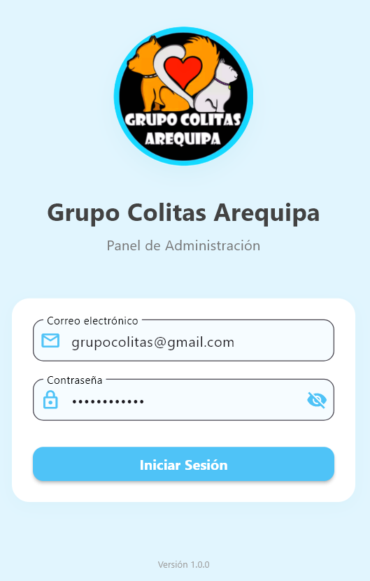
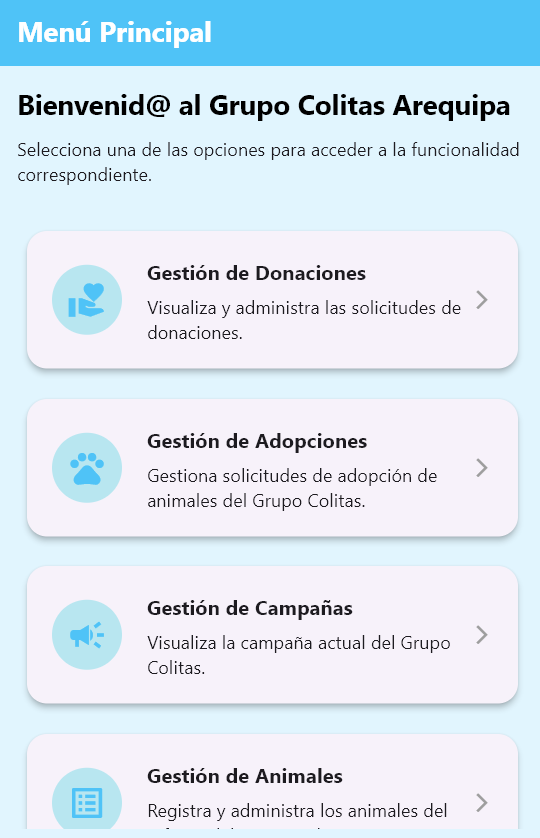
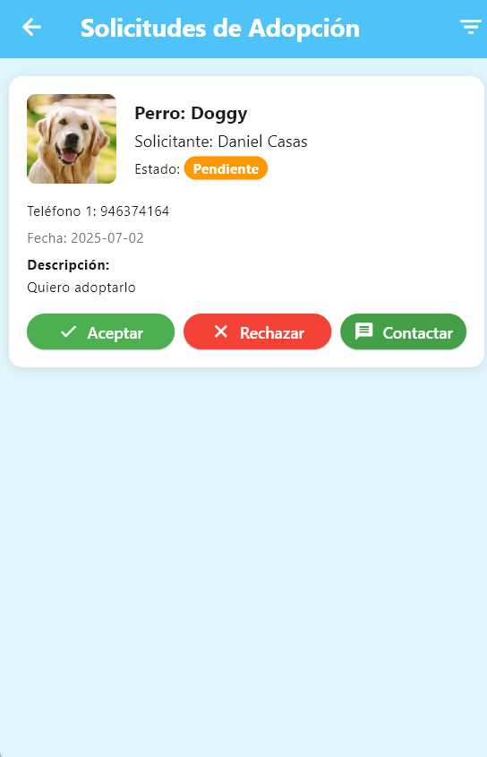
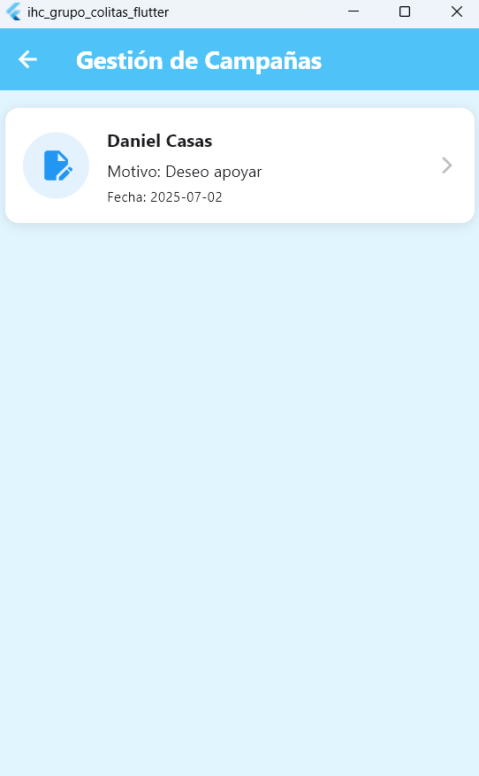

# Grupo Colitas Arequipa - Aplicación Móvil

Una aplicación Flutter para la gestión administrativa del refugio de animales "Grupo Colitas Arequipa". Esta aplicación permite a los administradores gestionar animales, donaciones, campañas y adopciones de manera eficiente.

## 📱 Características Principales



### 🐕 Gestión de Animales
- **Registro de perros**: Agregar nuevos perros al refugio con información completa
- **Edición de información**: Actualizar datos de los animales registrados
- **Gestión de adopciones**: Marcar perros como adoptados
- **Galería de imágenes**: Visualización optimizada de fotos de los animales
- **Filtros**: Filtrar animales por estado (Disponible, Adoptado, En Tratamiento)



### 💰 Gestión de Donaciones
- **Visualización de donaciones**: Lista paginada de todas las donaciones
- **Detalles de donación**: Información completa
- **Gestión de comprobantes**: Visualización de documentos de respaldo
- **Estados de donación**: Seguimiento del estado de cada donación


### 📋 Gestión de Campañas
- **Campañas activas**: Visualización de campañas del refugio
- **Gestión de firmas**: Administración de firmas de apoyo
- **Detalles de participación**: Información detallada de cada firma



### 🔐 Panel de Administración
- **Autenticación segura**: Login con Supabase Authentication
- **Sesiones persistentes**: Manejo seguro de sesiones de usuario
- **Acceso controlado**: Solo usuarios autenticados pueden gestionar datos

## 🛠️ Tecnologías Utilizadas

### Frontend
- **Flutter 3.8.0+**: Framework principal para desarrollo multiplataforma
- **Dart**: Lenguaje de programación

### Backend y Base de Datos
- **Supabase**: Backend-as-a-Service para autenticación y base de datos
- **PostgreSQL**: Base de datos relacional a través de Supabase
- **Supabase Storage**: Almacenamiento de imágenes y documentos

### Arquitectura y Patrones
- **MVVM (Model-View-ViewModel)**: Patrón arquitectónico principal
- **Provider**: Gestión de estado reactivo
- **Repository Pattern**: Abstracción de acceso a datos

### Principales Dependencias
```yaml
dependencies:
  flutter: "sdk: flutter"
  supabase_flutter: ^2.0.0      # Backend y autenticación
  provider: ^6.1.2              # Gestión de estado
  image_picker: ^1.1.2          # Selección de imágenes
  cached_network_image: ^3.3.1  # Cache optimizado de imágenes
  flutter_cache_manager: ^3.3.1 # Gestión avanzada de cache
  package_info_plus: ^8.3.0     # Información de la aplicación
```

## 📁 Estructura del Proyecto

```
lib/
├── core/                    # Configuraciones y recursos globales
│   ├── cache_config.dart   # Configuración de cache de imágenes
│   ├── colors.dart         # Paleta de colores de la aplicación
│   ├── strings.dart        # Textos y constantes de la aplicación
│   └── supabase.dart       # Configuración de Supabase
├── models/                  # Modelos de datos
│   ├── auth_state.dart     # Estados de autenticación
│   ├── donacion_model.dart # Modelo de donaciones
│   ├── firma_model.dart    # Modelo de firmas de campaña
│   ├── perro_model.dart    # Modelo de datos de perros
│   └── user_model.dart     # Modelo de usuario
├── repositories/           # Capa de acceso a datos
│   ├── auth_repository.dart      # Gestión de autenticación
│   ├── donacion_repository.dart  # Operaciones CRUD de donaciones
│   ├── firma_repository.dart     # Gestión de firmas
│   └── perro_repository.dart     # Operaciones CRUD de perros
├── viewmodels/             # Lógica de negocio (MVVM)
│   ├── donacion_viewmodel.dart   # ViewModel para donaciones
│   ├── firma_viewmodel.dart      # ViewModel para firmas
│   ├── login_viewmodel.dart      # ViewModel para autenticación
│   └── perro_viewmodel.dart      # ViewModel para gestión de perros
├── views/                  # Interfaz de usuario
│   ├── agregar_perro_screen.dart     # Pantalla para agregar perros
│   ├── campanas_screen.dart          # Pantalla de campañas
│   ├── donacion_detalle_screen.dart  # Detalle de donaciones
│   ├── donaciones_screen.dart        # Lista de donaciones
│   ├── editar_perro_screen.dart      # Edición de perros
│   ├── firma_detalle_screen.dart     # Detalle de firmas
│   ├── login.dart                    # Pantalla de login
│   ├── main_menu.dart                # Menú principal
│   ├── perro_detalle_screen.dart     # Detalle de perros
│   └── perros_screen.dart            # Lista de perros
├── widgets/                # Componentes reutilizables
│   ├── adopcion_confirmation_dialog.dart  # Diálogo de confirmación
│   ├── base_confirmation_dialog.dart      # Diálogo base reutilizable
│   ├── base_form.dart                     # Formulario base
│   └── menu_option_card.dart              # Tarjetas del menú
├── app.dart               # Configuración principal de la app
└── main.dart             # Punto de entrada de la aplicación
```

## 🚀 Instalación y Configuración

### Prerrequisitos
- Flutter SDK 3.8.0 o superior
- Dart SDK 
- Android Studio / VS Code
- Cuenta de Supabase configurada

### Pasos de Instalación

1. **Clonar el repositorio**
   ```bash
   git clone [<url-del-repositorio>](https://github.com/RodrigoStranger/ihc-grupo-colitas-flutter.git)
   cd ihc-grupo-colitas-flutter
   ```

2. **Instalar dependencias**
   ```bash
   flutter pub get
   ```

3. **Configurar Supabase**
   - Crear un proyecto en [Supabase](https://supabase.com)
   - Configurar las credenciales en `lib/core/supabase.dart`
   - Configurar las tablas necesarias (Perros, Donaciones, Firmas)

4. **Ejecutar la aplicación**
   ```bash
   flutter run
   ```

## 📊 Base de Datos

### Tablas Principales

#### Tabla: Perros
- `IdPerro` (Primary Key)
- `NombrePerro` - Nombre del animal
- `EdadPerro` - Edad en años
- `SexoPerro` - Sexo del animal
- `RazaPerro` - Raza
- `TipoPelajePerro` - Tipo de pelaje
- `EstaturaPerro` - Tamaño del animal
- `ActividadPerro` - Nivel de actividad
- `EstadoPerro` - Estado actual (Disponible/Adoptado/En Tratamiento)
- `DescripcionPerro` - Descripción detallada
- `FotoPerro` - URL de la imagen
- `IngresoPerro` - Fecha de ingreso

## 🎨 Características Técnicas

### Gestión de Estado
- **Provider Pattern**: Para manejo reactivo del estado global
- **ChangeNotifier**: Para notificaciones automáticas de cambios
- **Consumer/Selector**: Para actualizaciones optimizadas de UI

### Optimizaciones de Rendimiento
- **Cache inteligente**: Gestión optimizada de imágenes con expiración
- **Carga lazy**: Imágenes se cargan bajo demanda
- **Paginación**: Carga incremental de datos para mejor rendimiento
- **Precarga**: Adelantamiento de carga de contenido probable

### Manejo de Imágenes
- **URLs firmadas**: Acceso seguro a imágenes en Supabase Storage
- **Cache multinivel**: Cache en memoria y disco
- **Compresión**: Optimización automática de imágenes
- **Fallbacks**: Manejo graceful de errores de carga

## 🧪 Testing

Para ejecutar las pruebas:
```bash
flutter test
```

## 📱 Plataformas Soportadas

- ✅ Android
- ✅ iOS  
- ✅ Windows (Desktop)

## 📋 Roadmap

### Próximas Funcionalidades
- [ ] Notificaciones push para nuevas adopciones
- [ ] Sistema de reportes y estadísticas
- [ ] Integración con redes sociales
- [ ] App para adoptantes (complementaria)

### Mejoras Técnicas
- [ ] Tests unitarios completos
- [ ] Tests de integración
- [ ] CI/CD pipeline
- [ ] Documentación de API
- [ ] Internacionalización (i18n)

## 📄 Licencia

Este proyecto está bajo la Licencia MIT

## 📞 Contacto

**Grupo Colitas Arequipa**
- Sitio web: https://grupo-colitas-aqp.vercel.app/home
- Facebook: https://www.facebook.com/people/Asociaci%C3%B3n-Colitas-Oficial-Arequipa/100088175020547/?rdid=vqISWL2JHRi89qNO&share_url=https%3A%2F%2Fwww.facebook.com%2Fshare%2F1AKkzZcoLX%2F

---

Desarrollado con ❤️ para el bienestar animal
